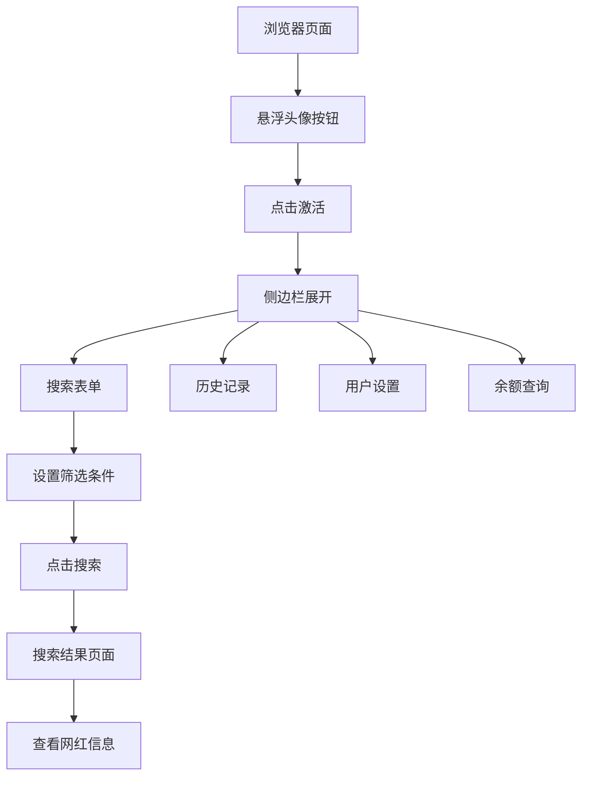

# LinkSurge Chrome插件 - 产品需求文档

## 1. Product Overview

LinkSurge Chrome插件是一个基于浏览器的网红搜索工具，为用户提供便捷的网红筛选和项目管理功能。插件采用侧边栏固定模式，通过悬浮按钮激活，让用户在浏览任何网页时都能快速访问网红搜索功能。

该插件解决了用户需要频繁切换标签页进行网红搜索的问题，提供了更加流畅的工作流体验，特别适合营销人员、品牌方和内容创作者使用。

产品目标是成为Chrome浏览器中最便捷的网红搜索和管理工具，提升用户的工作效率。

## 2. Core Features

### 2.1 User Roles

| Role | Registration Method | Core Permissions |
|------|---------------------|------------------|
| 普通用户 | Chrome插件安装后自动激活 | 基础搜索功能、查看搜索历史 |
| 高级用户 | 账号登录升级 | 高级筛选、项目管理、数据导出 |

### 2.2 Feature Module

我们的Chrome插件需求包含以下主要功能模块：

1. **悬浮触发按钮**：浏览器右侧悬浮头像按钮，点击激活插件
2. **侧边栏主界面**：固定在浏览器右侧的搜索表单界面
3. **搜索结果页面**：展示筛选后的网红列表和详细信息
4. **历史记录页面**：查看和管理历史搜索记录
5. **用户设置页面**：账户管理、偏好设置和余额查询

### 2.3 Page Details

| Page Name | Module Name | Feature description |
|-----------|-------------|---------------------|
| 悬浮触发按钮 | 浮动按钮 | 显示用户头像，点击展开/收起侧边栏，支持拖拽位置调整 |
| 侧边栏主界面 | 搜索表单 | 项目选择、地区筛选、视频类型选择、粉丝数范围、观看数范围设置 |
| 侧边栏主界面 | 导航栏 | 显示Logo、固定/取消固定按钮、关闭按钮 |
| 侧边栏主界面 | 功能菜单 | 历史任务、教程、余额查询、用户头像按钮 |
| 搜索结果页面 | 结果列表 | 展示网红卡片、筛选条件、分页导航、导出功能 |
| 历史记录页面 | 历史列表 | 显示搜索历史、删除记录、重新搜索功能 |
| 用户设置页面 | 账户信息 | 登录状态、余额显示、设置偏好、帮助文档 |

## 3. Core Process

### 普通用户操作流程
1. 用户安装Chrome插件后，浏览器右侧出现悬浮头像按钮
2. 点击悬浮按钮，侧边栏从右侧滑入并固定显示
3. 用户在搜索表单中设置筛选条件（项目、地区、视频类型、粉丝数、观看数）
4. 点击"找相似博主"按钮，跳转到搜索结果页面
5. 查看搜索结果，可以查看详细信息或导出数据
6. 通过侧边栏菜单访问历史记录、教程或余额信息

### 高级用户操作流程
1. 登录账户后获得更多筛选选项和项目管理功能
2. 可以创建和管理多个项目，保存搜索模板
3. 访问高级筛选功能和数据分析工具
4. 导出详细的网红数据报告

## 4. User Interface Design

### 4.1 Design Style

- **主色调**：温暖橙色 (#F7EDE2) 作为主背景色，深色文字 (#1F2937) 确保可读性
- **辅助色**：白色 (#FFFFFF) 用于卡片背景，灰色 (#6B7280) 用于次要文字
- **按钮样式**：圆角矩形设计，主按钮使用品牌色，次要按钮使用灰色调
- **字体**：系统默认字体，标题使用 18-20px，正文使用 14-16px
- **布局风格**：卡片式设计，右侧固定侧边栏，响应式布局适配不同屏幕
- **图标风格**：使用 Lucide React 图标库，线性风格，保持一致性

### 4.2 Page Design Overview

| Page Name | Module Name | UI Elements |
|-----------|-------------|-------------|
| 悬浮触发按钮 | 浮动按钮 | 圆形头像按钮，半透明背景，悬停效果，位置固定在右侧中部 |
| 侧边栏主界面 | 顶部导航 | Logo + 标题，固定按钮，关闭按钮，橙色背景 (#F7EDE2) |
| 侧边栏主界面 | 搜索表单 | 圆角输入框，下拉选择器，自定义数值输入，主按钮圆角设计 |
| 侧边栏主界面 | 底部菜单 | 垂直图标菜单，文字标签，悬停状态变化，用户头像按钮 |
| 搜索结果页面 | 结果卡片 | 网红头像，统计数据，标签展示，操作按钮，卡片阴影效果 |

### 4.3 Responsiveness

插件设计为固定宽度的侧边栏模式（约 400px），适配桌面端Chrome浏览器。侧边栏内容采用响应式设计，确保在不同分辨率下都能正常显示。支持鼠标交互，包括点击、悬停和滚动操作。