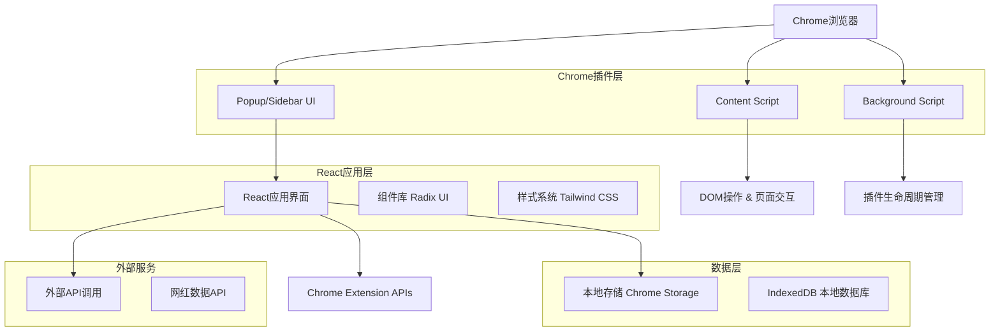
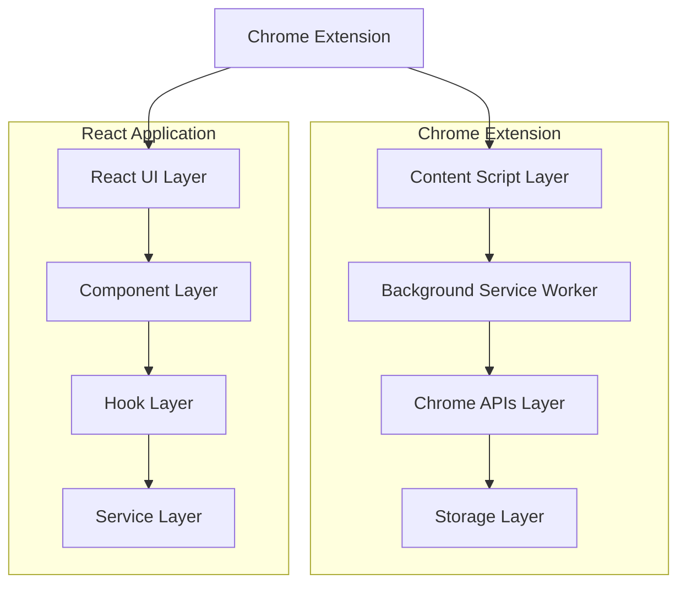
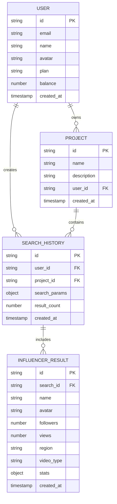

# LinkSurge Chrome插件 - 技术架构文档

## 1. Architecture design



## 2. Technology Description

- Frontend: React@18 + JSX + Tailwind CSS@4 + Radix UI + Vite
- Build Tool: Vite + @crxjs/vite-plugin (Chrome Extension Plugin)
- Storage: Chrome Storage API + IndexedDB
- Icons: Lucide React
- State Management: React Hooks + Context API
- File Extensions: .jsx for React components, .js for JavaScript files
- Chrome Extension: Manifest V3, Content Scripts, Background Service Worker
- UI Framework: React Portal for Sidebar injection

## 3. Route definitions

| Route | Purpose |
|-------|---------|
| /popup | 插件弹窗主页面，包含搜索表单和导航 |
| /sidebar | 侧边栏模式的主界面，固定在浏览器右侧 |
| /results | 搜索结果页面，展示网红列表和筛选结果 |
| /history | 外部超链接页面，跳转到新标签页显示用户的搜索历史 |
| /balance | 外部超链接页面，跳转到新标签页显示用户账户信息和余额 |
| /settings | 外部超链接页面，跳转到新标签页进行用户偏好和插件配置 |

## 4. API definitions

### 4.1 Core API

网红搜索相关
```
POST /api/influencers/search
```

Request:
| Param Name | Param Type | isRequired | Description |
|------------|------------|------------|-------------|
| project | string | false | 项目名称 |
| region | string | false | 全球地区筛选，支持搜索功能，按中文首字母排序，包含国旗标识 |
| videoType | string | false | 视频类型 |
| followersMin | number | false | 最小粉丝数 |
| followersMax | number | false | 最大粉丝数 |
| viewsMin | number | false | 最小观看数 |
| viewsMax | number | false | 最大观看数 |

Response:
| Param Name | Param Type | Description |
|------------|------------|-------------|
| success | boolean | 请求是否成功 |
| data | array | 网红数据列表 |
| total | number | 总结果数量 |
| page | number | 当前页码 |

Example
```json
{
  "project": "项目A",
  "region": "中国 🇨🇳",
  "videoType": "Vlog",
  "followersMin": 10000,
  "followersMax": 100000
}
```

### 4.2 地区筛选数据结构

全球地区列表（按中文首字母排序，包含国旗标识）：

```jsx
const regionOptions = [
  // A
  { value: "阿尔巴尼亚", label: "阿尔巴尼亚 🇦🇱", searchKey: "albania" },
  { value: "阿尔及利亚", label: "阿尔及利亚 🇩🇿", searchKey: "algeria" },
  { value: "阿富汗", label: "阿富汗 🇦🇫", searchKey: "afghanistan" },
  { value: "阿根廷", label: "阿根廷 🇦🇷", searchKey: "argentina" },
  { value: "阿联酋", label: "阿联酋 🇦🇪", searchKey: "uae" },
  { value: "阿曼", label: "阿曼 🇴🇲", searchKey: "oman" },
  { value: "阿塞拜疆", label: "阿塞拜疆 🇦🇿", searchKey: "azerbaijan" },
  { value: "埃及", label: "埃及 🇪🇬", searchKey: "egypt" },
  { value: "埃塞俄比亚", label: "埃塞俄比亚 🇪🇹", searchKey: "ethiopia" },
  { value: "爱尔兰", label: "爱尔兰 🇮🇪", searchKey: "ireland" },
  { value: "爱沙尼亚", label: "爱沙尼亚 🇪🇪", searchKey: "estonia" },
  { value: "安道尔", label: "安道尔 🇦🇩", searchKey: "andorra" },
  { value: "安哥拉", label: "安哥拉 🇦🇴", searchKey: "angola" },
  { value: "安提瓜和巴布达", label: "安提瓜和巴布达 🇦🇬", searchKey: "antigua-barbuda" },
  { value: "奥地利", label: "奥地利 🇦🇹", searchKey: "austria" },
  { value: "澳大利亚", label: "澳大利亚 🇦🇺", searchKey: "australia" },
  { value: "澳门", label: "澳门 🇲🇴", searchKey: "macau" },
  
  // B
  { value: "巴巴多斯", label: "巴巴多斯 🇧🇧", searchKey: "barbados" },
  { value: "巴布亚新几内亚", label: "巴布亚新几内亚 🇵🇬", searchKey: "papua-new-guinea" },
  { value: "巴哈马", label: "巴哈马 🇧🇸", searchKey: "bahamas" },
  { value: "巴基斯坦", label: "巴基斯坦 🇵🇰", searchKey: "pakistan" },
  { value: "巴拉圭", label: "巴拉圭 🇵🇾", searchKey: "paraguay" },
  { value: "巴林", label: "巴林 🇧🇭", searchKey: "bahrain" },
  { value: "巴拿马", label: "巴拿马 🇵🇦", searchKey: "panama" },
  { value: "巴西", label: "巴西 🇧🇷", searchKey: "brazil" },
  { value: "白俄罗斯", label: "白俄罗斯 🇧🇾", searchKey: "belarus" },
  { value: "保加利亚", label: "保加利亚 🇧🇬", searchKey: "bulgaria" },
  { value: "贝宁", label: "贝宁 🇧🇯", searchKey: "benin" },
  { value: "比利时", label: "比利时 🇧🇪", searchKey: "belgium" },
  { value: "冰岛", label: "冰岛 🇮🇸", searchKey: "iceland" },
  { value: "波兰", label: "波兰 🇵🇱", searchKey: "poland" },
  { value: "波黑", label: "波黑 🇧🇦", searchKey: "bosnia-herzegovina" },
  { value: "玻利维亚", label: "玻利维亚 🇧🇴", searchKey: "bolivia" },
  { value: "博茨瓦纳", label: "博茨瓦纳 🇧🇼", searchKey: "botswana" },
  { value: "伯利兹", label: "伯利兹 🇧🇿", searchKey: "belize" },
  { value: "不丹", label: "不丹 🇧🇹", searchKey: "bhutan" },
  { value: "布基纳法索", label: "布基纳法索 🇧🇫", searchKey: "burkina-faso" },
  { value: "布隆迪", label: "布隆迪 🇧🇮", searchKey: "burundi" },
  
  // C
  { value: "朝鲜", label: "朝鲜 🇰🇵", searchKey: "north-korea" },
  { value: "赤道几内亚", label: "赤道几内亚 🇬🇶", searchKey: "equatorial-guinea" },
  
  // D
  { value: "丹麦", label: "丹麦 🇩🇰", searchKey: "denmark" },
  { value: "德国", label: "德国 🇩🇪", searchKey: "germany" },
  { value: "东帝汶", label: "东帝汶 🇹🇱", searchKey: "east-timor" },
  { value: "多哥", label: "多哥 🇹🇬", searchKey: "togo" },
  { value: "多米尼加", label: "多米尼加 🇩🇴", searchKey: "dominican-republic" },
  { value: "多米尼克", label: "多米尼克 🇩🇲", searchKey: "dominica" },
  
  // E
  { value: "俄罗斯", label: "俄罗斯 🇷🇺", searchKey: "russia" },
  { value: "厄瓜多尔", label: "厄瓜多尔 🇪🇨", searchKey: "ecuador" },
  { value: "厄立特里亚", label: "厄立特里亚 🇪🇷", searchKey: "eritrea" },
  
  // F
  { value: "法国", label: "法国 🇫🇷", searchKey: "france" },
  { value: "梵蒂冈", label: "梵蒂冈 🇻🇦", searchKey: "vatican" },
  { value: "菲律宾", label: "菲律宾 🇵🇭", searchKey: "philippines" },
  { value: "斐济", label: "斐济 🇫🇯", searchKey: "fiji" },
  { value: "芬兰", label: "芬兰 🇫🇮", searchKey: "finland" },
  { value: "佛得角", label: "佛得角 🇨🇻", searchKey: "cape-verde" },
  
  // G
  { value: "冈比亚", label: "冈比亚 🇬🇲", searchKey: "gambia" },
  { value: "刚果布", label: "刚果布 🇨🇬", searchKey: "congo-brazzaville" },
  { value: "刚果金", label: "刚果金 🇨🇩", searchKey: "congo-kinshasa" },
  { value: "哥伦比亚", label: "哥伦比亚 🇨🇴", searchKey: "colombia" },
  { value: "哥斯达黎加", label: "哥斯达黎加 🇨🇷", searchKey: "costa-rica" },
  { value: "格林纳达", label: "格林纳达 🇬🇩", searchKey: "grenada" },
  { value: "格鲁吉亚", label: "格鲁吉亚 🇬🇪", searchKey: "georgia" },
  { value: "古巴", label: "古巴 🇨🇺", searchKey: "cuba" },
  { value: "圭亚那", label: "圭亚那 🇬🇾", searchKey: "guyana" },
  { value: "哈萨克斯坦", label: "哈萨克斯坦 🇰🇿", searchKey: "kazakhstan" },
  { value: "海地", label: "海地 🇭🇹", searchKey: "haiti" },
  { value: "韩国", label: "韩国 🇰🇷", searchKey: "south-korea" },
  { value: "荷兰", label: "荷兰 🇳🇱", searchKey: "netherlands" },
  { value: "黑山", label: "黑山 🇲🇪", searchKey: "montenegro" },
  { value: "洪都拉斯", label: "洪都拉斯 🇭🇳", searchKey: "honduras" },
  { value: "基里巴斯", label: "基里巴斯 🇰🇮", searchKey: "kiribati" },
  { value: "吉布提", label: "吉布提 🇩🇯", searchKey: "djibouti" },
  { value: "吉尔吉斯斯坦", label: "吉尔吉斯斯坦 🇰🇬", searchKey: "kyrgyzstan" },
  { value: "几内亚", label: "几内亚 🇬🇳", searchKey: "guinea" },
  { value: "几内亚比绍", label: "几内亚比绍 🇬🇼", searchKey: "guinea-bissau" },
  { value: "加纳", label: "加纳 🇬🇭", searchKey: "ghana" },
  { value: "加拿大", label: "加拿大 🇨🇦", searchKey: "canada" },
  { value: "加蓬", label: "加蓬 🇬🇦", searchKey: "gabon" },
  { value: "柬埔寨", label: "柬埔寨 🇰🇭", searchKey: "cambodia" },
  { value: "捷克", label: "捷克 🇨🇿", searchKey: "czech-republic" },
  { value: "津巴布韦", label: "津巴布韦 🇿🇼", searchKey: "zimbabwe" },
  
  // K
  { value: "喀麦隆", label: "喀麦隆 🇨🇲", searchKey: "cameroon" },
  { value: "卡塔尔", label: "卡塔尔 🇶🇦", searchKey: "qatar" },
  { value: "科摩罗", label: "科摩罗 🇰🇲", searchKey: "comoros" },
  { value: "科特迪瓦", label: "科特迪瓦 🇨🇮", searchKey: "ivory-coast" },
  { value: "科威特", label: "科威特 🇰🇼", searchKey: "kuwait" },
  { value: "克罗地亚", label: "克罗地亚 🇭🇷", searchKey: "croatia" },
  { value: "肯尼亚", label: "肯尼亚 🇰🇪", searchKey: "kenya" },
  { value: "库克群岛", label: "库克群岛 🇨🇰", searchKey: "cook-islands" },
  
  // L
  { value: "拉脱维亚", label: "拉脱维亚 🇱🇻", searchKey: "latvia" },
  { value: "莱索托", label: "莱索托 🇱🇸", searchKey: "lesotho" },
  { value: "老挝", label: "老挝 🇱🇦", searchKey: "laos" },
  { value: "黎巴嫩", label: "黎巴嫩 🇱🇧", searchKey: "lebanon" },
  { value: "立陶宛", label: "立陶宛 🇱🇹", searchKey: "lithuania" },
  { value: "利比里亚", label: "利比里亚 🇱🇷", searchKey: "liberia" },
  { value: "利比亚", label: "利比亚 🇱🇾", searchKey: "libya" },
  { value: "列支敦士登", label: "列支敦士登 🇱🇮", searchKey: "liechtenstein" },
  { value: "卢森堡", label: "卢森堡 🇱🇺", searchKey: "luxembourg" },
  { value: "卢旺达", label: "卢旺达 🇷🇼", searchKey: "rwanda" },
  { value: "罗马尼亚", label: "罗马尼亚 🇷🇴", searchKey: "romania" },
  
  // M
  { value: "马达加斯加", label: "马达加斯加 🇲🇬", searchKey: "madagascar" },
  { value: "马尔代夫", label: "马尔代夫 🇲🇻", searchKey: "maldives" },
  { value: "马耳他", label: "马耳他 🇲🇹", searchKey: "malta" },
  { value: "马拉维", label: "马拉维 🇲🇼", searchKey: "malawi" },
  { value: "马来西亚", label: "马来西亚 🇲🇾", searchKey: "malaysia" },
  { value: "马里", label: "马里 🇲🇱", searchKey: "mali" },
  { value: "马绍尔群岛", label: "马绍尔群岛 🇲🇭", searchKey: "marshall-islands" },
  { value: "毛里求斯", label: "毛里求斯 🇲🇺", searchKey: "mauritius" },
  { value: "毛里塔尼亚", label: "毛里塔尼亚 🇲🇷", searchKey: "mauritania" },
  { value: "美国", label: "美国 🇺🇸", searchKey: "usa" },
  { value: "蒙古", label: "蒙古 🇲🇳", searchKey: "mongolia" },
  { value: "孟加拉国", label: "孟加拉国 🇧🇩", searchKey: "bangladesh" },
  { value: "秘鲁", label: "秘鲁 🇵🇪", searchKey: "peru" },
  { value: "密克罗尼西亚", label: "密克罗尼西亚 🇫🇲", searchKey: "micronesia" },
  { value: "缅甸", label: "缅甸 🇲🇲", searchKey: "myanmar" },
  { value: "摩尔多瓦", label: "摩尔多瓦 🇲🇩", searchKey: "moldova" },
  { value: "摩洛哥", label: "摩洛哥 🇲🇦", searchKey: "morocco" },
  { value: "摩纳哥", label: "摩纳哥 🇲🇨", searchKey: "monaco" },
  { value: "莫桑比克", label: "莫桑比克 🇲🇿", searchKey: "mozambique" },
  { value: "墨西哥", label: "墨西哥 🇲🇽", searchKey: "mexico" },
  
  // N
  { value: "纳米比亚", label: "纳米比亚 🇳🇦", searchKey: "namibia" },
  { value: "南非", label: "南非 🇿🇦", searchKey: "south-africa" },
  { value: "南苏丹", label: "南苏丹 🇸🇸", searchKey: "south-sudan" },
  { value: "瑙鲁", label: "瑙鲁 🇳🇷", searchKey: "nauru" },
  { value: "尼泊尔", label: "尼泊尔 🇳🇵", searchKey: "nepal" },
  { value: "尼加拉瓜", label: "尼加拉瓜 🇳🇮", searchKey: "nicaragua" },
  { value: "尼日尔", label: "尼日尔 🇳🇪", searchKey: "niger" },
  { value: "尼日利亚", label: "尼日利亚 🇳🇬", searchKey: "nigeria" },
  { value: "挪威", label: "挪威 🇳🇴", searchKey: "norway" },
  
  // P
  { value: "帕劳", label: "帕劳 🇵🇼", searchKey: "palau" },
  { value: "葡萄牙", label: "葡萄牙 🇵🇹", searchKey: "portugal" },
  
  // Q
  { value: "乔治亚", label: "乔治亚 🇬🇪", searchKey: "georgia" },
  
  // R
  { value: "日本", label: "日本 🇯🇵", searchKey: "japan" },
  { value: "瑞典", label: "瑞典 🇸🇪", searchKey: "sweden" },
  { value: "瑞士", label: "瑞士 🇨🇭", searchKey: "switzerland" },
  
  // S
  { value: "萨尔瓦多", label: "萨尔瓦多 🇸🇻", searchKey: "el-salvador" },
  { value: "萨摩亚", label: "萨摩亚 🇼🇸", searchKey: "samoa" },
  { value: "塞尔维亚", label: "塞尔维亚 🇷🇸", searchKey: "serbia" },
  { value: "塞拉利昂", label: "塞拉利昂 🇸🇱", searchKey: "sierra-leone" },
  { value: "塞内加尔", label: "塞内加尔 🇸🇳", searchKey: "senegal" },
  { value: "塞浦路斯", label: "塞浦路斯 🇨🇾", searchKey: "cyprus" },
  { value: "塞舌尔", label: "塞舌尔 🇸🇨", searchKey: "seychelles" },
  { value: "沙特阿拉伯", label: "沙特阿拉伯 🇸🇦", searchKey: "saudi-arabia" },
  { value: "圣多美和普林西比", label: "圣多美和普林西比 🇸🇹", searchKey: "sao-tome-principe" },
  { value: "圣基茨和尼维斯", label: "圣基茨和尼维斯 🇰🇳", searchKey: "saint-kitts-nevis" },
  { value: "圣卢西亚", label: "圣卢西亚 🇱🇨", searchKey: "saint-lucia" },
  { value: "圣马力诺", label: "圣马力诺 🇸🇲", searchKey: "san-marino" },
  { value: "圣文森特和格林纳丁斯", label: "圣文森特和格林纳丁斯 🇻🇨", searchKey: "saint-vincent-grenadines" },
  { value: "斯里兰卡", label: "斯里兰卡 🇱🇰", searchKey: "sri-lanka" },
  { value: "斯洛伐克", label: "斯洛伐克 🇸🇰", searchKey: "slovakia" },
  { value: "斯洛文尼亚", label: "斯洛文尼亚 🇸🇮", searchKey: "slovenia" },
  { value: "斯威士兰", label: "斯威士兰 🇸🇿", searchKey: "eswatini" },
  { value: "苏丹", label: "苏丹 🇸🇩", searchKey: "sudan" },
  { value: "苏里南", label: "苏里南 🇸🇷", searchKey: "suriname" },
  { value: "所罗门群岛", label: "所罗门群岛 🇸🇧", searchKey: "solomon-islands" },
  { value: "索马里", label: "索马里 🇸🇴", searchKey: "somalia" },
  
  // T
  { value: "塔吉克斯坦", label: "塔吉克斯坦 🇹🇯", searchKey: "tajikistan" },
  { value: "台湾", label: "台湾 🇹🇼", searchKey: "taiwan" },
  { value: "泰国", label: "泰国 🇹🇭", searchKey: "thailand" },
  { value: "坦桑尼亚", label: "坦桑尼亚 🇹🇿", searchKey: "tanzania" },
  { value: "汤加", label: "汤加 🇹🇴", searchKey: "tonga" },
  { value: "特立尼达和多巴哥", label: "特立尼达和多巴哥 🇹🇹", searchKey: "trinidad-tobago" },
  { value: "突尼斯", label: "突尼斯 🇹🇳", searchKey: "tunisia" },
  { value: "图瓦卢", label: "图瓦卢 🇹🇻", searchKey: "tuvalu" },
  { value: "土耳其", label: "土耳其 🇹🇷", searchKey: "turkey" },
  { value: "土库曼斯坦", label: "土库曼斯坦 🇹🇲", searchKey: "turkmenistan" },
  
  // W
  { value: "瓦努阿图", label: "瓦努阿图 🇻🇺", searchKey: "vanuatu" },
  { value: "危地马拉", label: "危地马拉 🇬🇹", searchKey: "guatemala" },
  { value: "委内瑞拉", label: "委内瑞拉 🇻🇪", searchKey: "venezuela" },
  { value: "文莱", label: "文莱 🇧🇳", searchKey: "brunei" },
  { value: "乌干达", label: "乌干达 🇺🇬", searchKey: "uganda" },
  { value: "乌克兰", label: "乌克兰 🇺🇦", searchKey: "ukraine" },
  { value: "乌拉圭", label: "乌拉圭 🇺🇾", searchKey: "uruguay" },
  { value: "乌兹别克斯坦", label: "乌兹别克斯坦 🇺🇿", searchKey: "uzbekistan" },
  
  // X
  { value: "西班牙", label: "西班牙 🇪🇸", searchKey: "spain" },
  { value: "希腊", label: "希腊 🇬🇷", searchKey: "greece" },
  { value: "新加坡", label: "新加坡 🇸🇬", searchKey: "singapore" },
  { value: "新西兰", label: "新西兰 🇳🇿", searchKey: "new-zealand" },
  { value: "匈牙利", label: "匈牙利 🇭🇺", searchKey: "hungary" },
  { value: "叙利亚", label: "叙利亚 🇸🇾", searchKey: "syria" },
  { value: "香港", label: "香港 🇭🇰", searchKey: "hong-kong" },
  
  // Y
  { value: "牙买加", label: "牙买加 🇯🇲", searchKey: "jamaica" },
  { value: "亚美尼亚", label: "亚美尼亚 🇦🇲", searchKey: "armenia" },
  { value: "也门", label: "也门 🇾🇪", searchKey: "yemen" },
  { value: "伊拉克", label: "伊拉克 🇮🇶", searchKey: "iraq" },
  { value: "伊朗", label: "伊朗 🇮🇷", searchKey: "iran" },
  { value: "以色列", label: "以色列 🇮🇱", searchKey: "israel" },
  { value: "意大利", label: "意大利 🇮🇹", searchKey: "italy" },
  { value: "印度", label: "印度 🇮🇳", searchKey: "india" },
  { value: "印度尼西亚", label: "印度尼西亚 🇮🇩", searchKey: "indonesia" },
  { value: "英国", label: "英国 🇬🇧", searchKey: "united-kingdom" },
  { value: "约旦", label: "约旦 🇯🇴", searchKey: "jordan" },
  { value: "越南", label: "越南 🇻🇳", searchKey: "vietnam" },
  
  // Z
  { value: "赞比亚", label: "赞比亚 🇿🇲", searchKey: "zambia" },
  { value: "乍得", label: "乍得 🇹🇩", searchKey: "chad" },
  { value: "智利", label: "智利 🇨🇱", searchKey: "chile" },
  { value: "中非", label: "中非 🇨🇫", searchKey: "central-african-republic" },
  { value: "中国", label: "中国 🇨🇳", searchKey: "china" }
];

// 搜索功能实现
const searchRegions = (searchTerm) => {
  return regionOptions.filter(region => 
    region.label.toLowerCase().includes(searchTerm.toLowerCase()) ||
    region.searchKey.toLowerCase().includes(searchTerm.toLowerCase())
  );
};
```

用户历史记录
```
GET /api/user/history
```

Response:
| Param Name | Param Type | Description |
|------------|------------|-------------|
| success | boolean | 请求是否成功 |
| data | array | 历史记录列表 |
| timestamp | string | 搜索时间 |
| searchParams | object | 搜索参数 |

## 5. Server architecture diagram



## 6. Chrome插件实现方案

### 6.1 Manifest V3 配置

```json
{
  "manifest_version": 3,
  "name": "LinkSurge - 网红搜索助手",
  "version": "1.0.0",
  "description": "便捷的网红搜索和筛选工具，提升营销效率",
  
  "permissions": [
    "storage",
    "activeTab",
    "scripting"
  ],
  
  "host_permissions": [
    "https://*/*"
  ],
  
  "background": {
    "service_worker": "background.js"
  },
  
  "content_scripts": [
    {
      "matches": ["<all_urls>"],
      "js": ["content.js"],
      "css": ["content.css"],
      "run_at": "document_end"
    }
  ],
  
  "action": {
    "default_popup": "popup.html",
    "default_title": "LinkSurge",
    "default_icon": {
      "16": "icons/icon16.png",
      "32": "icons/icon32.png",
      "48": "icons/icon48.png",
      "128": "icons/icon128.png"
    }
  },
  
  "icons": {
    "16": "icons/icon16.png",
    "32": "icons/icon32.png", 
    "48": "icons/icon48.png",
    "128": "icons/icon128.png"
  },
  
  "web_accessible_resources": [
    {
      "resources": ["sidebar.html", "assets/*"],
      "matches": ["<all_urls>"]
    }
  ]
}
```

### 6.2 插件文件结构

```
linksurge_plugin/
├── manifest.json                 # 插件配置文件
├── background.js                 # 后台服务脚本
├── content.js                    # 内容脚本
├── content.css                   # 内容脚本样式
├── popup.html                    # 弹窗页面
├── popup.js                      # 弹窗脚本
├── sidebar.html                  # 侧边栏页面
├── sidebar.js                    # 侧边栏脚本
├── icons/                        # 图标文件
│   ├── icon16.png
│   ├── icon32.png
│   ├── icon48.png
│   └── icon128.png
├── assets/                       # 静态资源
│   ├── css/
│   ├── js/
│   └── images/
├── src/                          # React源码
│   ├── components/
│   │   ├── SearchForm.jsx
│   │   ├── ResultsList.jsx
│   │   ├── FloatingButton.jsx
│   │   └── Sidebar.jsx
│   ├── hooks/
│   │   ├── useStorage.js
│   │   ├── useSearch.js
│   │   └── useHistory.js
│   ├── utils/
│   │   ├── api.js
│   │   ├── storage.js
│   │   └── constants.js
│   └── styles/
│       └── globals.css
├── package.json                  # 项目配置
├── vite.config.js               # 构建配置
└── README.md                    # 说明文档
```

### 6.3 核心脚本实现方案

**Background Service Worker (background.js)**
```javascript
// 插件生命周期管理
chrome.runtime.onInstalled.addListener(() => {
  // 初始化存储
  chrome.storage.local.set({
    userConfig: { sidebarVisible: false },
    searchHistory: { searches: [] }
  });
});

// 处理消息通信
chrome.runtime.onMessage.addListener((request, sender, sendResponse) => {
  switch (request.action) {
    case 'toggleSidebar':
      handleToggleSidebar(sender.tab.id);
      break;
    case 'searchInfluencers':
      handleSearch(request.params, sendResponse);
      break;
  }
  return true;
});
```

**Content Script (content.js)**
```javascript
// 注入悬浮按钮
function injectFloatingButton() {
  const button = document.createElement('div');
  button.id = 'linksurge-floating-btn';
  button.innerHTML = `
    
  `;
  document.body.appendChild(button);
  
  button.addEventListener('click', toggleSidebar);
}

// 注入侧边栏
function injectSidebar() {
  const sidebar = document.createElement('iframe');
  sidebar.id = 'linksurge-sidebar';
  sidebar.src = chrome.runtime.getURL('sidebar.html');
  sidebar.style.cssText = `
    position: fixed;
    top: 0;
    right: -400px;
    width: 400px;
    height: 100vh;
    z-index: 10000;
    border: none;
    transition: right 0.3s ease;
  `;
  document.body.appendChild(sidebar);
}

// 页面加载完成后初始化
if (document.readyState === 'loading') {
  document.addEventListener('DOMContentLoaded', init);
} else {
  init();
}

function init() {
  injectFloatingButton();
  injectSidebar();
}
```

### 6.4 React组件集成方案

**Sidebar React应用 (sidebar.html + sidebar.js)**
```html
<!DOCTYPE html>
<html>
<head>
  <meta charset="utf-8">
  <title>LinkSurge Sidebar</title>
  <link rel="stylesheet" href="assets/css/sidebar.css">
</head>
<body>
  <div id="sidebar-root"></div>
  <script src="sidebar.js"></script>
</body>
</html>
```

```javascript
// sidebar.js - React应用入口
import React from 'react';
import ReactDOM from 'react-dom/client';
import SidebarApp from './src/components/SidebarApp.jsx';

const root = ReactDOM.createRoot(document.getElementById('sidebar-root'));
root.render(<SidebarApp />);
```

### 6.5 构建配置 (vite.config.js)

```javascript
import { defineConfig } from 'vite';
import react from '@vitejs/plugin-react';
import { crx } from '@crxjs/vite-plugin';
import manifest from './manifest.json';

export default defineConfig({
  plugins: [
    react(),
    crx({ manifest })
  ],
  build: {
    rollupOptions: {
      input: {
        popup: 'popup.html',
        sidebar: 'sidebar.html',
        content: 'content.js',
        background: 'background.js'
      }
    }
  },
  server: {
    port: 5173,
    hmr: {
      port: 5174
    }
  }
});
```

### 6.6 开发和构建流程

**开发环境启动**
```bash
# 安装依赖
npm install

# 开发模式（支持热重载）
npm run dev

# 构建生产版本
npm run build

# 打包为crx文件
npm run package
```

**package.json 脚本配置**
```json
{
  "scripts": {
    "dev": "vite",
    "build": "vite build",
    "preview": "vite preview",
    "package": "npm run build && web-ext build --source-dir=dist"
  },
  "dependencies": {
    "react": "^18.2.0",
    "react-dom": "^18.2.0",
    "lucide-react": "^0.263.1"
  },
  "devDependencies": {
    "@vitejs/plugin-react": "^4.0.3",
    "@crxjs/vite-plugin": "^1.0.14",
    "vite": "^4.4.5",
    "tailwindcss": "^3.3.0",
    "web-ext": "^7.6.2"
  }
}
```

## 7. Data model

### 7.1 Data model definition



### 7.2 Data Definition Language

Chrome插件本地存储结构（使用Chrome Storage API）：

```javascript
// 用户配置存储
const userConfig = {
  userId: "string",
  userInfo: {
    email: "string",
    name: "string", 
    avatar: "string",
    plan: "free|premium",
    balance: "number"
  },
  preferences: {
    sidebarPosition: "right|left",
    autoPin: "boolean",
    theme: "light|dark"
  }
};

// 搜索历史存储
const searchHistory = {
  searches: [
    {
      id: "string",
      timestamp: "ISO string",
      searchParams: {
        project: "string",
        region: "string", 
        videoType: "string",
        followersMin: "number",
        followersMax: "number",
        viewsMin: "number",
        viewsMax: "number"
      },
      resultCount: "number",
      results: [] // 缓存的搜索结果
    }
  ]
};

// 项目管理存储
const projects = {
  list: [
    {
      id: "string",
      name: "string",
      description: "string",
      created_at: "ISO string",
      searchTemplates: [] // 保存的搜索模板
    }
  ]
};
```

IndexedDB 结构（用于大量数据缓存）：

```javascript
// 数据库名称: LinkSurgeDB
// 版本: 1

// 对象存储: influencer_cache
const influencerCacheStore = {
  keyPath: "id",
  indexes: [
    { name: "region", keyPath: "region" },
    { name: "followers", keyPath: "followers" },
    { name: "timestamp", keyPath: "cached_at" }
  ]
};

// 对象存储: search_results
const searchResultsStore = {
  keyPath: "searchId", 
  indexes: [
    { name: "timestamp", keyPath: "created_at" },
    { name: "userId", keyPath: "userId" }
  ]
};
```